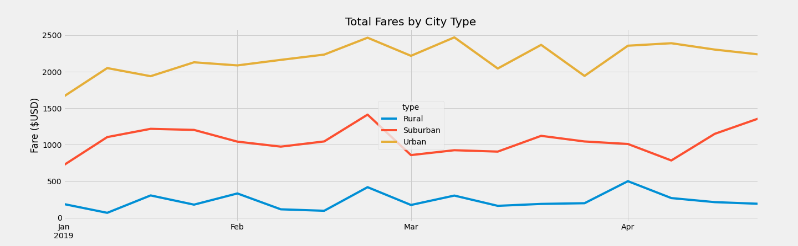

# PyBer_Analysis
Visualizing data using Python in Jupyter Notebook

## Project Overview
The purpose of this project is to analyze all the "PyBer" rideshare data from January to early May of 2019 and create compelling visualizations. Use Python and Pandas to create a summary DataFrame of the ride-sharing data by city type. Then, using Pandas and Matplotlib, create a multiple-line graph that shows the total weekly fares for each city type, along with written report that summarizes how the data differs by city type and how those differences can be used by decision-makers.

## Resources
- Data Source: city_data.csv, ride_data.csv
- Software: Python 3.7, Jupyter Notebook, 1.68.1

## Results
Based on the the Summary DataFrame and line chart below, we can see there may be a correlation between population density and use of service. We can see that the total rides, drivers, and fares increases from Rural (Low density) to Suburban (Moderate density) and the increases again from Suburban to Urban (High density). But the inverse occurs regarding the Average fares per ride and driver, with Urban areas having the lowest fare averages and Rural areas having the highest.

### Summary DataFrame for Urban, Suburban, and Rural ride-sharing data

<table border="1" class="dataframe">
  <thead>
    <tr style="text-align: right;">
      <th></th>
      <th>Total Rides</th>
      <th>Total Drivers</th>
      <th>Total Fares</th>
      <th>Average Fare per Ride</th>
      <th>Average Fare per Driver</th>
    </tr>
  </thead>
  <tbody>
    <tr>
      <th>Rural</th>
      <td>125</td>
      <td>78</td>
      <td>$4,327.93</td>
      <td>$34.62</td>
      <td>$55.49</td>
    </tr>
    <tr>
      <th>Suburban</th>
      <td>625</td>
      <td>490</td>
      <td>$19,356.33</td>
      <td>$30.97</td>
      <td>$39.50</td>
    </tr>
    <tr>
      <th>Urban</th>
      <td>1,625</td>
      <td>2,405</td>
      <td>$39,854.38</td>
      <td>$24.53</td>
      <td>$16.57</td>
    </tr>
  </tbody>
</table>

### Total Fares by City Type dataframe

<table border="1" class="dataframe">
  <thead>
    <tr style="text-align: right;">
      <th>type</th>
      <th>Rural</th>
      <th>Suburban</th>
      <th>Urban</th>
    </tr>
    <tr>
      <th>date</th>
      <th></th>
      <th></th>
      <th></th>
    </tr>
  </thead>
  <tbody>
    <tr>
      <th>2019-01-06</th>
      <td>187.92</td>
      <td>721.60</td>
      <td>1661.68</td>
    </tr>
    <tr>
      <th>2019-01-13</th>
      <td>67.65</td>
      <td>1105.13</td>
      <td>2050.43</td>
    </tr>
    <tr>
      <th>2019-01-20</th>
      <td>306.00</td>
      <td>1218.20</td>
      <td>1939.02</td>
    </tr>
    <tr>
      <th>2019-01-27</th>
      <td>179.69</td>
      <td>1203.28</td>
      <td>2129.51</td>
    </tr>
    <tr>
      <th>2019-02-03</th>
      <td>333.08</td>
      <td>1042.79</td>
      <td>2086.94</td>
    </tr>
    <tr>
      <th>2019-02-10</th>
      <td>115.80</td>
      <td>974.34</td>
      <td>2162.64</td>
    </tr>
    <tr>
      <th>2019-02-17</th>
      <td>95.82</td>
      <td>1045.50</td>
      <td>2235.07</td>
    </tr>
    <tr>
      <th>2019-02-24</th>
      <td>419.06</td>
      <td>1412.74</td>
      <td>2466.29</td>
    </tr>
    <tr>
      <th>2019-03-03</th>
      <td>175.14</td>
      <td>858.46</td>
      <td>2218.20</td>
    </tr>
    <tr>
      <th>2019-03-10</th>
      <td>303.94</td>
      <td>925.27</td>
      <td>2470.93</td>
    </tr>
  </tbody>
</table>

### Total Fares by City Type line chart for 01/01/2019 to 04/28/2019

## Summary
Based on the results, below are three business recommendations to address a few disparities among the city types.
- Reduce the number of drivers in urban areas, to increase the average fare per driver
- Increase fares in urban areas
- Provide a slight discount for rural customers. Decreasing the fares in rural areas, may increase the demand for service.
  - *Note: This may lead to a need for a fourth recommendation of increasing driver counts within Rural areas.*
